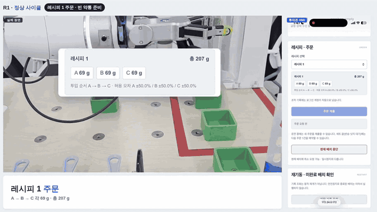
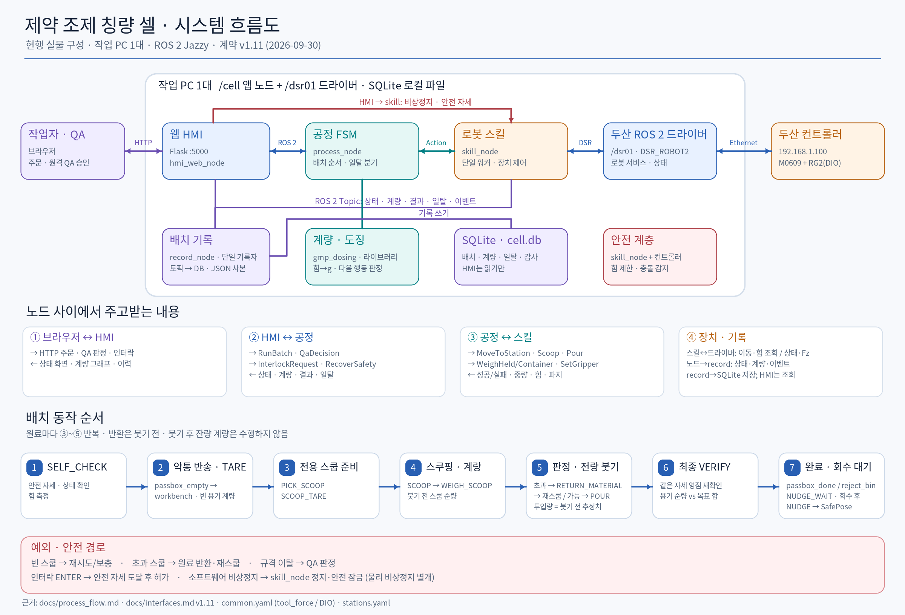
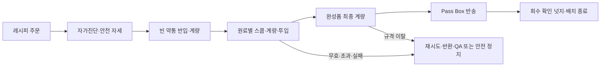

# 두숟가락 — 협동로봇 조제 칭량 셀

> 두산 부트캠프 협동로봇 프로젝트 · 2026.09.14 ~ 09.30 · 팀 **두숟가락**



*9/30 실물 시연 — 왼쪽은 셀, 오른쪽은 휴대폰 웹 HMI (2배속).* <!-- TODO: 전체 시연 영상(55 초) 링크 -->

**외부 저울 없이 로봇 팔의 힘센서로 무게를 재며, 레시피대로 원료를 퍼서 담는 무인 조제 셀**입니다.
두산 M0609 협동로봇과 RG2 그리퍼가 원료를 스쿱으로 퍼서 재고, 약통에 붓고, 최종 무게를 스스로 검증합니다.
일탈이 나면 셀 밖의 QA 담당자가 휴대폰 웹 HMI 로 판정하고, 모든 과정은 배치 기록과 감사 추적으로 남습니다.
사람은 패스박스와 HMI 로만 셀과 만납니다. 원료는 약품 대신 어항용 자갈(A·B·C)을 써서 조제 공정을 축소 실증했습니다.

## 핵심 기능

- **로봇이 곧 저울** — 관절 토크 기반 외력(`get_tool_force`)으로 계량합니다. 팔의 흔들림은 사인 적합으로 걷어내고, 고주파 게이트로 측정 무결성을 봅니다.
- **붓기 전에 판단** — 퍼낸 양이 넘치거나 모자라거나 계량을 못 믿으면 붓지 않고 원료통에 되돌린 뒤 다시 풉니다.
- **셀 밖 원격 QA** — 일탈이 나면 공정이 멈추고, QA 가 웹 HMI 에서 승인·폐기를 정합니다.
- **배치 기록·감사 추적** — 기록 노드 하나만 SQLite 에 쓰고, 이벤트는 덧붙이기만 합니다.
- **안전 계층** — 로봇을 움직이는 노드는 하나뿐이고, 비전 없이 힘 기반으로 접촉·충돌을 감지합니다(PFL). 소프트웨어 비상정지와 안전 자세 복귀를 갖췄습니다.

## 팀과 역할

| 이름 | 역할 | 맡은 패키지 | 주요 기여 |
|---|---|---|---|
| 고희태 | 조장 · A 스킬 | `gmp_skills` · `gmp_interfaces` · `gmp_bringup` | 로봇 스킬(이동·파지·스쿱·붓기·계량), 스테이션 티칭, 통신 계약·런치 |
| 김병직 | C 공정 · B 도징(설계·구현) | `gmp_process` · `gmp_dosing` | 공정 상태기계·일탈 처리, 도징 설계·구현(힘→무게 환산·보정·흔들림 적합·도징 정책), 9/30 시연 통합 |
| 김민준 | B 도징(측정) | `gmp_dosing` | 초기 계량 측정 참여, 고주파 게이트 입력 검증 보완 |
| 서동권 | D HMI·기록 | `gmp_hmi` | 웹 HMI(주문·상태·원격 QA·이력), SQLite 배치 기록·감사 추적 |

PM 없이 패키지마다 다른 팀원이 교차 검토했습니다([AGENTS.md](AGENTS.md)). 영역별 책임은 [docs/responsibilities.md](docs/responsibilities.md)에 있습니다.

## 시스템 설계와 플로우 차트



작업자는 웹 HMI 로 주문·QA 판정을 하고, `process_node` 가 공정을 결정합니다. `skill_node` 만 로봇을 제어하고, `record_node` 만 배치 기록을 씁니다. 자세한 통신 경로는 [노드 구성도](docs/diagrams/node_architecture.png)와 [구성 설명](docs/architecture.md)에 있습니다.



상태·예외 분기는 [공정 순서 설명](docs/process_flow.md)과 [draw.io 흐름도](docs/diagrams/process_flow.drawio)에, 작업공간 배치는 [배치도](docs/diagrams/workcell_layout.png)에 있습니다.

## 결과 (9/30 시연)

| 항목 | 결과 |
|---|---|
| 레시피 1 실물 배치 (A·B·C 각 69 g) | 원료 투입은 원료마다 한 스쿱으로 일탈 없이 완료. 최종 계량 직전 영점 이동(−0.384 N)으로 QA 승인을 거쳐 종료 |
| 원료별 로봇 계산치 vs 외부 저울 | A 65.3 / 57 · B 87.0 / 95 · C 81.6 / 76 g — 차이 ±8.3 g 이내 |
| 최종 순량 (목표 207 g) | 로봇 계량 207.7 g · 외부 저울 원료 합 228 g |
| 실물로 확인한 예외 경로 | 초과·하한 미달 스쿱 반환 → 재스쿱, QA 원격 판정, 폐기 → 안전 자세 → 넛지 대기 |
| 자동 시험 | 1,104건 통과 (process 266 · skills 592 · dosing 91 · hmi 149 · tools 6, 가상 모드 포함) |

가상 모드 시험은 호출·상태 흐름을 확인할 뿐, 실제 힘·파지력·간섭·안전 정지 성능을 입증하지는 않습니다.

## 한계와 향후 과제

- **시연 설정으로 허용폭을 넓혔습니다.** 스쿱 한 번의 계량 산포(±8~15 g)가 허용폭과 같은 크기라, 레시피 1 은 허용오차 ±50 %, 빈 그리퍼 영점 이동 한계는 0.5 N 으로 시연했습니다(레시피 2·3 은 ±15 %).
- **센서 영점이 흐릅니다.** 한 배치 안에서 −0.384 N(≈ 39 g) 움직였습니다 → 배치 중 영점 재측정이 필요합니다.
- **다시 쥘 때마다 무게가 달라집니다.** 재파지 σ 6.99 g(한 번 쥔 채로는 0.85 g) → 치구·손가락 패드로 파지 반복성을 높여야 합니다.
- **최종 무게를 로봇이 약 9 % 낮게 읽습니다**(그리퍼 케이블 정리 전 26 % 에서 개선).
- **스쿱 깊이 제어 없이 고정 경로**(끝까지 담금)만 씁니다. 붓기 후 잔량 계량은 뺐고, 투입량은 붓기 전 순량으로 추정합니다.

시행착오와 해결 과정은 [docs/trial_and_error_0929-0930.md](docs/trial_and_error_0929-0930.md)에 정리했습니다.

## 운영체제 환경

Ubuntu 24.04 · ROS 2 Jazzy · Python 3.12를 사용합니다. 작업 PC 1대에서 셀 노드·웹 HMI·SQLite를 실행합니다.

## 사용 장비

- 두산 M0609 협동로봇과 컨트롤러, OnRobot RG2 그리퍼
- 원료 A/B/C 통, 원료별 전용 스쿱, 약통, Pass Box, 작업대
- 계량은 외부 저울 대신 로봇 외력(`get_tool_force`)을 사용

## 의존성

Python 패키지 목록은 [requirements.txt](requirements.txt)에 있습니다. [requirements.md](requirements.md)는 ROS 2·시스템 패키지·벤더 언더레이와 선택 의존성을 구분해 설명합니다.

## 빌드 — 언더레이 위에 오버레이

`~/ws_cobot_pjt/ws_dsr`(doosan-robot2 · onrobot-ros2 · m0609_rg2_bringup, 9/16 실기 확인) 를 **먼저 source** 하고 이 저장소를 얹는다.

```bash
source /opt/ros/jazzy/setup.bash
source ~/ws_cobot_pjt/ws_dsr/install/setup.bash
cd ~/auto-pharmacist/ros2_ws && colcon build --symlink-install && source install/setup.bash
```

## 실행 순서

ROS 2와 벤더 언더레이 source → 이 저장소 빌드·source → `cell.launch.py` 실행 → 노드/Action 확인 → HMI에서 주문합니다. 명령·순서·게이트는 [시연 절차](docs/demo_run_procedure.md)를 따릅니다.

기본 `cell.launch.py` 한 번으로 로봇 bringup과 셀 앱 노드 4개가 모두 시작됩니다.
로봇 bringup은 두산 컨트롤러·에뮬레이터/실물 연결과 설정에 따른 RG2 드라이버를 포함합니다.
약 12초 뒤 `/cell/skill_node`(로봇 스킬), `/cell/process_node`(공정),
`/cell/record_node`(기록), `/cell/hmi_web_node`(웹 HMI)를 시작합니다.
`hmi:=false`는 웹 HMI만 빼고 기록 노드는 유지하며, `gui:=false`는 RViz만 끕니다.
`gmp_dosing`은 공정에서 가져다 쓰는 라이브러리이고 `gmp_interfaces`는 메시지 정의라 별도 노드가 없습니다.
런치가 시작됐어도 노드 준비가 끝났다는 뜻은 아니므로 아래 확인 명령으로 실제 기동을 확인합니다.

```bash
ros2 launch gmp_bringup cell.launch.py mode:=virtual              # 에뮬레이터 + RViz (랜선 없이)
```
```bash
ros2 launch gmp_bringup cell.launch.py mode:=real host:=192.168.1.100 vel_scale:=0.2  # 첫 기동
```

```bash
ros2 node list
ros2 action list -t
```

### 각 노드 개별 실행

아래는 실물 모드 예시입니다. 저장소 루트에서 실행하며, `cell.launch.py`와 동시에 띄우지 않습니다.
기존 스킬을 먼저 종료하고 bringup 종료까지 확인한 뒤 재시작합니다.
로봇 bringup으로 컨트롤러 활성화를 확인한 다음, 서로 다른 터미널에서 스킬·공정·기록·HMI를 한 개씩 실행합니다.

터미널 1 — 로봇 연결·제어권:

```bash
source tools/env.sh
export ROS_HOME=/tmp/gmp-ros-domain70
export ROS_LOG_DIR=/tmp/gmp-g2-ros-log
GMP_DSR_WS="$(dirname "$(dirname "$WS_DSR_SETUP")")"
export PYTHONPATH="$GMP_DSR_WS/build/onrobot_rg_control${PYTHONPATH:+:$PYTHONPATH}"
ros2 launch gmp_bringup robot.launch.py mode:=real host:=192.168.1.100 gui:=false
```

`ROS_HOME`은 다른 도메인의 컨트롤러 spawner 잠금과 분리한다.
`PYTHONPATH`는 현 언더레이의 RG2 Python 모듈 위치를 보완한다.

터미널 2 — 컨트롤러 활성화 확인 후 스킬 노드 실행:
`skill.launch.py`가 공통 설정과 스테이션 파일을 전달합니다.

```bash
source tools/env.sh
export ROS_LOG_DIR=/tmp/gmp-g2-ros-log
ros2 launch gmp_bringup skill.launch.py mode:=real vel_scale:=0.2
```

검증된 속도를 지정하려면 `vel_scale`을 변경한다. 스쿱을 잡은 채 재기동할 때는
[파지 상태 복원 절차](docs/setup.md#인출-완료-스쿱의-기동-시-복원)를 따르며,
복원 확인 인자를 상시 실행 명령에 넣지 않는다.

터미널 3~5 — 공정·기록·HMI 노드를 실행합니다. **각 터미널에서 먼저** 저장소 루트로 이동해 다음 환경을 설정합니다.

```bash
source tools/env.sh
GMP_PARAMS="$(ros2 pkg prefix gmp_bringup)/share/gmp_bringup/params"
GMP_DB="$HOME/auto-pharmacist/records/cell.db"
```

공정 노드:

```bash
ros2 run gmp_process process_node --ros-args -r __ns:=/cell \
  --params-file "$GMP_PARAMS/common.yaml" -p stations_file:="$GMP_PARAMS/stations.yaml"
```

기록 노드:

```bash
ros2 run gmp_hmi record_node --ros-args -r __ns:=/cell \
  --params-file "$GMP_PARAMS/common.yaml" \
  -p db_path:="$GMP_DB" -p export_dir:="$(dirname "$GMP_DB")"
```

웹 HMI 노드:

```bash
ros2 run gmp_hmi hmi_web_node --ros-args -r __ns:=/cell \
  --params-file "$GMP_PARAMS/common.yaml" \
  -p db_path:="$GMP_DB" -p recipes_dir:="$GMP_PARAMS/recipes" -p port:=5000
```

실물에서 RG2 Modbus 백엔드를 쓰면 `robot.launch.py`가 상태 드라이버를 함께 띄웁니다.
위 개별 명령은 전체 런치와 같은 `/cell` 네임스페이스와 공통 설정을 사용합니다.

## 구조

```text
ros2_ws/src/
├── gmp_interfaces/     # msg/srv/action 계약                                  [조장]
├── gmp_dsr_controller/ # 두산 컨트롤러 충돌 감도 조회 플러그인                  [A 스킬]
├── gmp_skills/         # 로봇·그리퍼 스킬 — 로봇을 만지는 유일한 노드           [A 스킬]
├── gmp_dosing/         # 힘→그램 환산·영점·보정, 도징 정책 (ROS 비의존)          [B 도징]
├── gmp_process/        # 레시피 실행 상태기계, 일탈·인터락                       [C 공정]
├── gmp_hmi/            # 웹 HMI·원격 QA, 배치 기록 DB·감사 추적                  [D HMI·기록]
└── gmp_bringup/        # launch(real/virtual), params(공통·스테이션·레시피)     [조장]
tools/                  # 환경 스크립트, 도면 생성기
docs/                   # 설계·계약·절차·시행착오
```

각 앱 패키지는 `nodes/`(ROS 통신) · `core/`(ROS 비의존 로직, 단위 시험 대상) · `adapters/`(장치)로 나뉩니다.

## 산출물 안내

[최종 산출물 정리](https://app.notion.com/p/3e7d1a852505808f8ac1c880d49721a5)의 9개 항목을 저장소 원본과 연결했습니다. 노션은 설명·화면 자료를 모은 사본이며, 실행값과 계약은 저장소 원본이 기준입니다.

| 항목 | 저장소 원본 | 상세 산출물 |
|---|---|---|
| 01 시스템 아키텍처 | [시스템 구성도](docs/diagrams/system_flow.png) · [구성 설명](docs/architecture.md) | [노션](https://app.notion.com/p/3ead1a8525058141928be68dfefe26d0) |
| 02 네트워크 구성 | [환경·실행 절차](docs/setup.md) · [런치 설정](ros2_ws/src/gmp_bringup/launch/cell.launch.py) | [노션 구성도](https://app.notion.com/p/3ead1a85250581a88493f6ed8ec912f1) |
| 03 동작 순서도 | [공정 흐름도](docs/diagrams/process_flow.drawio) · [상태·예외 설명](docs/process_flow.md) | [노션](https://app.notion.com/p/3ead1a85250581e88633feeae9748709) |
| 04 하드웨어·환경·배치 | [작업공간 배치도](docs/diagrams/workcell_layout.png) · [스테이션 설정](ros2_ws/src/gmp_bringup/params/stations.yaml) | [노션](https://app.notion.com/p/3ead1a852505818a89bacbe5e07e21e9) |
| 05 토픽·서비스·액션 | [인터페이스 계약](docs/interfaces.md) · [메시지 정의](ros2_ws/src/gmp_interfaces) | [노션](https://app.notion.com/p/3ead1a85250581b790e4cf722bf82f87) |
| 06 ROS 2 노드·데이터 흐름 | [노드 구성도](docs/diagrams/node_architecture.png) · [구성 설명](docs/architecture.md) | [노션](https://app.notion.com/p/3ead1a85250581ed9552d90cb4b4481f) |
| 07 HMI·대시보드 | [HMI 기능 설명](ros2_ws/src/gmp_hmi/README.md) | [노션 화면 자료](https://app.notion.com/p/3ead1a852505817a900bffcd230f41d6) |
| 08 예외·오류 처리 | [공정 흐름](docs/process_flow.md) · [확정 정책](docs/SOT.md) | [노션](https://app.notion.com/p/3ead1a8525058194b5acee4b04958f5f) |
| 09 위험요소·안전대책 | [안전 결정](docs/SOT.md) · [실행·복구 주의사항](docs/setup.md) | [노션](https://app.notion.com/p/3ead1a85250581eea10ef85c7b12972a) |

## 기준 문서

- [docs/SOT.md](docs/SOT.md) 확정 결정 · [docs/interfaces.md](docs/interfaces.md) 통신 계약(v1.11.1) · [docs/architecture.md](docs/architecture.md) 데이터 흐름
- [PROJECT_RULES.md](PROJECT_RULES.md) 요구·제약 원장 · [PROJECT.md](PROJECT.md) 개요 · [docs/spec/](docs/spec/README.md) BRD·SDD
- [AGENTS.md](AGENTS.md) 작업·교차검수 규칙 · [GitHub Issues](https://github.com/Jik-Kim/auto-pharmacist/issues) 할 일·이슈(9/21 부터 정본, `docs/todo.md`·`docs/issues.md` 는 동결 스냅샷)
- `practice/<파트>/CURRENT.md` 파트별 현행값과 작업 일지 · 9/30 시연 당일 운영값은 [SOT D-36~D-43](docs/SOT.md)
